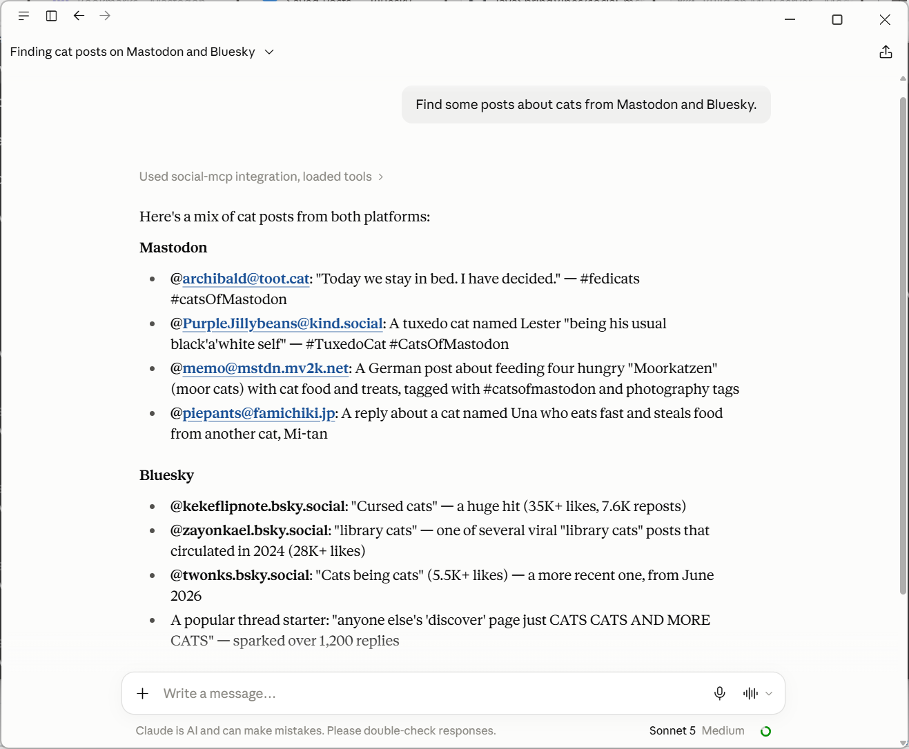

# SocialMCP

An [MCP](https://modelcontextprotocol.io) server that lets AI agents read, publish and interact on **Mastodon** and
**Bluesky**.

Connect it to Claude Code, Claude Desktop or any other MCP client, and you can ask things like:

- "Summarise my Mastodon and Bluesky timelines"
- "What is going on with Java and AI on both platforms?"
- "Who liked and replied to my latest post? Thank the first reply."
- "Find people who post content similar to @habuma.com and follow them"
- "Post this long write-up to Mastodon and Bluesky as a thread"
- "Quote Craig's latest post and add my take", or "Ask my Mastodon followers: Java or Kotlin?"

The agent combines the server's tools to answer these questions. Both platforms are exposed through a single set of
tools, and the server normalizes their APIs into one common shape.



Built with Java 25, Spring Boot 4.1 and Spring AI 2.0. It runs over the STDIO transport.

## Tools

| Tool | What it does |
|---|---|
| `searchSocialPosts` | Search posts by keyword or `#hashtag`, newest first or by engagement (`sort=top`) |
| `getSocialTimeline` | Your home feed (`type=home`) or your own posts (`type=own`) |
| `getSocialUserPosts` | A user's recent public posts (no replies, no reposts) |
| `getSocialProfile` | Profile summary with bio and follower/following/post counts (omit `handle` for your own) |
| `getSocialPostInteractions` | A post's replies, plus the accounts that liked and reposted it |
| `getSocialTrends` | Trending tags and posts (Mastodon) or trending topics (Bluesky) |
| `findSimilarAccounts` | Accounts that post content similar to a given user |
| `getSocialBookmarks` | Your bookmarked posts, most recently bookmarked first |
| `getSocialPostingRules` | The platform's length limits, how it counts characters, its quote and poll support, and its image limits |
| `checkSocialPost` | Measure draft posts, and check image files, against the limits without posting |
| `createSocialPost` | Publish a single post, optionally quoting another post, with up to 4 images, or (Mastodon) with a poll |
| `createSocialThread` | Publish a numbered self-thread, checking every part before anything is posted |
| `replyToSocialPost` | Reply to any post, optionally with images; on Mastodon the author is @mentioned so they're notified |
| `setAccountRelationship` | `follow`, `unfollow`, `block`, `unblock`, `mute` or `unmute` an account |
| `setPostAction` | `like`, `unlike`, `repost`, `unrepost`, `bookmark` or `unbookmark` a post |
| `voteInSocialPoll` | Vote in a Mastodon poll |

Every tool takes a `platform` argument (`mastodon` or `bluesky`). Tool definitions only list the platforms you have
configured credentials for, so if you configure only one platform, the agent never sees the other.

Every post returned by a tool includes its `quote` (the post it quotes, if any), `poll` (numbered options, counts,
and your own vote) and `media` (attached images and videos with their alt text), so the agent can read and act on
them.

### Images

`createSocialPost` and `replyToSocialPost` take up to 4 images, each with alt text. An image is an absolute file path
on your computer or an `https://` URL; the server reads or downloads it itself. JPEG, PNG, GIF and WebP are supported.

The server checks every image before uploading anything, and never resizes one. Limits differ: Mastodon reports its
own (usually 16 MB and 33 megapixels), and Bluesky allows 2 MB per image. `checkSocialPost` checks image files without
posting and, for any that are too large, gives the size to resize to (`fitWithin`). On Bluesky the server removes EXIF
and other metadata, such as GPS location, before upload; Mastodon does this itself.

| Client | Images |
|---|---|
| **Claude Code** | Fully supported, and recommended: it works with your files directly and can resize or convert images (for example iPhone HEIC photos) before posting |
| **Claude Desktop** | Works when you give a file path and the image already fits the limits. Photos attached to the chat can't be posted, because the server can't see them |
| **Cowork** | Not supported for images, because its files live in a sandbox the server can't read. Text tools work |

When an image can't be posted, the error says why and what to do, for example to give a path on your computer or to
resize the image to a given size.

**Safe to retry:** each write action first checks the current state and does nothing if it's already as asked. For
example, following someone you already follow reports `already-following`, and it doesn't reset your notification
settings for them. The tool descriptions also tell the agent to act only on what you asked for, and never to block
on its own judgement.

## Requirements

- JDK 25
- A Mastodon account, a Bluesky account, or both

Maven isn't required because the project includes the Maven wrapper.

## Build

```bash
./mvnw clean package
```

On Windows, use `mvnw.cmd clean package`.

This command runs the tests and produces `target/social-mcp-server-0.0.1-SNAPSHOT.jar`. The build compiles with
[Error Prone](https://errorprone.info) and [NullAway](https://github.com/uber/NullAway), so it fails on null-safety
violations. The javac flags they need are already in `.mvn/jvm.config`.

## Getting credentials

You only need credentials for the platforms you want to use. Missing credentials never stop the server from starting,
and that platform is simply left out of the tools.

### Mastodon: access token

1. Sign in to your instance (for example `https://mastodon.social`).
2. Go to **Preferences → Development → New application**.
3. Enter a name, such as `SocialMCP`. You can leave the website and redirect URI at their defaults.
4. Under **Scopes**, uncheck the top-level `read`, `write` and `follow` boxes, then check only the ones you need:

   | Scope | Needed for |
   |---|---|
   | `read:accounts`, `read:search`, `read:statuses` | All the read tools (always needed) |
   | `write:statuses` | Posts, threads, replies, quotes, polls, reposts and votes |
   | `read:follows` | `setAccountRelationship` (checks the current relationship first) |
   | `write:follows` | Follow and unfollow |
   | `write:blocks` | Block and unblock |
   | `write:mutes` | Mute and unmute |
   | `write:favourites` | Like and unlike |
   | `write:bookmarks` | Bookmark and unbookmark |
   | `read:bookmarks` | `getSocialBookmarks` |
   | `write:media` | Posts and replies with images |

5. Click **Submit**, open the application, and copy **Your access token**.

If a tool needs a scope your token doesn't have, it fails with a message naming the scopes to add. Mastodon doesn't
add scopes to an existing token: tick them on the application, save, click **Regenerate access token**, and update
`MASTODON_ACCESS_TOKEN`. Quote posts need Mastodon 4.5 or later on your server.

Set `MASTODON_ACCESS_TOKEN` to the token, and set `MASTODON_INSTANCE_URL` to your instance if it isn't
`mastodon.social`.

### Bluesky: app password

Use an **app password**, not your account password. It can be revoked on its own, and it works with accounts that
have two-factor sign-in enabled.

1. In Bluesky, go to **Settings → Privacy and security → App passwords**.
2. Click **Add App Password**, give it a name such as `SocialMCP`, and leave **Allow access to your direct messages**
   unchecked.
3. Copy the password (it looks like `xxxx-xxxx-xxxx-xxxx`). It is shown only once.

Set `BLUESKY_HANDLE` to your handle (for example `alice.bsky.social`, without the `@`) and `BLUESKY_APP_PASSWORD` to
the app password. If your account is on a self-hosted PDS, also set `BLUESKY_PDS_URL`.

> **Keep credentials out of git.** Pass them as environment variables in your MCP client's configuration, never in
> `application.properties`.

## Usage

The server speaks MCP over stdin/stdout, so your MCP client starts it as a subprocess. Use the absolute path to the
jar you built.

### Claude Code

```bash
claude mcp add social-mcp \
  -e MASTODON_INSTANCE_URL=https://mastodon.social \
  -e MASTODON_ACCESS_TOKEN=your-token \
  -e BLUESKY_HANDLE=alice.bsky.social \
  -e BLUESKY_APP_PASSWORD=xxxx-xxxx-xxxx-xxxx \
  -- java -jar /absolute/path/to/social-mcp-server-0.0.1-SNAPSHOT.jar
```

Run `/mcp` inside Claude Code to check that it connected.

### Claude Desktop and other MCP clients

Add the server to the client's MCP configuration. For Claude Desktop, that's `claude_desktop_config.json`:

```json
{
  "mcpServers": {
    "social-mcp": {
      "command": "java",
      "args": ["-jar", "/absolute/path/to/social-mcp-server-0.0.1-SNAPSHOT.jar"],
      "env": {
        "MASTODON_INSTANCE_URL": "https://mastodon.social",
        "MASTODON_ACCESS_TOKEN": "your-token",
        "BLUESKY_HANDLE": "alice.bsky.social",
        "BLUESKY_APP_PASSWORD": "xxxx-xxxx-xxxx-xxxx"
      }
    }
  }
}
```

On Windows, write the path with forward slashes, for example `C:/Users/you/social-mcp-server/target/...jar`.

## Configuration

All settings are environment variables. Only the credentials are needed, and everything else has a default.

| Variable | Default | Description |
|---|---|---|
| `MASTODON_INSTANCE_URL` | `https://mastodon.social` | Your Mastodon instance |
| `MASTODON_ACCESS_TOKEN` | *(empty)* | Mastodon access token. When it's empty, Mastodon is disabled |
| `MASTODON_THREAD_VISIBILITY` | `unlisted` | Visibility of thread parts after the first (`unlisted` or `public`) |
| `MASTODON_MAX_LENGTH` | `500` | Fallback post length, used only if the instance's limit can't be read |
| `BLUESKY_HANDLE` | *(empty)* | Your Bluesky handle, without `@` |
| `BLUESKY_APP_PASSWORD` | *(empty)* | Bluesky app password. When it's empty, Bluesky is disabled |
| `BLUESKY_PDS_URL` | `https://bsky.social` | Your PDS, if self-hosted |
| `BLUESKY_MAX_IMAGE_BYTES` | `2000000` | Largest Bluesky image. Set `1000000` if your self-hosted PDS still enforces the old 1 MB limit |
| `SOCIAL_MEDIA_ALLOWED_DIRS` | *(empty)* | Comma-separated directories images may be read from. Empty means any file the server can read |
| `SOCIAL_MEDIA_ALLOW_URLS` | `true` | Set to `false` to accept only local image files |
| `SOCIAL_MEDIA_MAX_READ_BYTES` | `20971520` | Largest image file read or downloaded (20 MiB) |
| `SOCIAL_MEDIA_DOWNLOAD_TIMEOUT` | `30s` | Time limit for downloading an image URL |
| `SOCIAL_MEDIA_PROCESSING_TIMEOUT` | `30s` | How long to wait for Mastodon to process an upload |
| `SOCIAL_POSTING_ENABLED` | `true` | Set to `false` to run read-only: every tool that changes something (posts, replies, follows, blocks, mutes, likes, reposts, bookmarks, votes) refuses, while reading keeps working |
| `SOCIAL_READ_DEFAULT_LIMIT` | `10` | Items returned when the agent gives no `limit` |
| `SOCIAL_READ_MAX_LIMIT` | `40` | Upper bound for `limit` (1–100) |
| `SOCIAL_THREAD_MAX_PARTS` | `10` | Maximum parts in one thread (2–25) |
| `SOCIAL_MCP_LOG_FILE` | `<tmp>/social-mcp-server.log` | Log file. Stdout is reserved for MCP messages, so logs never go to the console |

If the server doesn't start, look in the log file. An invalid setting, such as `SOCIAL_THREAD_MAX_PARTS=1`, stops
startup with a message there that names the problem.

## Limitations

- Posts can carry images, but not video. Images can't be combined with a poll, or with a quote on Mastodon, and
  threads don't take images (post the first part with `createSocialPost`, then reply). On Bluesky, links and
  mentions are posted as plain text and aren't clickable.
- Deleting or editing posts, direct messages, and approving follow requests aren't supported. Neither are blocking
  or muting a whole server, or managing Bluesky moderation lists.
- Bluesky has no polls, so polls and voting are Mastodon-only. Neither platform has a "dislike": `unlike` removes
  your own like.
- Mutes are always full and indefinite. A follow uses the platform's defaults and never changes the options of an
  existing follow.
- On Mastodon, counts, replies and trends reflect what your instance knows about through federation. Bluesky trends
  come from an unstable API that may change.

## Project layout

```
src/main/java/com/socialmcp/
├── tools/      MCP tool definitions and argument validation
├── platform/   SocialPlatformService, plus one implementation per platform (mastodon/, bluesky/)
├── model/      Records returned by the tools
├── media/      Reading, checking and stripping metadata from images
├── text/       Post length counting and HTML-to-text conversion
└── config/     Typed, validated configuration
```

`SPEC.md` has the full specification: the tool contracts, the platform API calls, and the error handling rules.

## License

Licensed under the [Apache License, Version 2.0](LICENSE).
